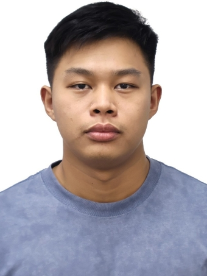
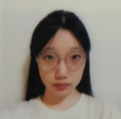
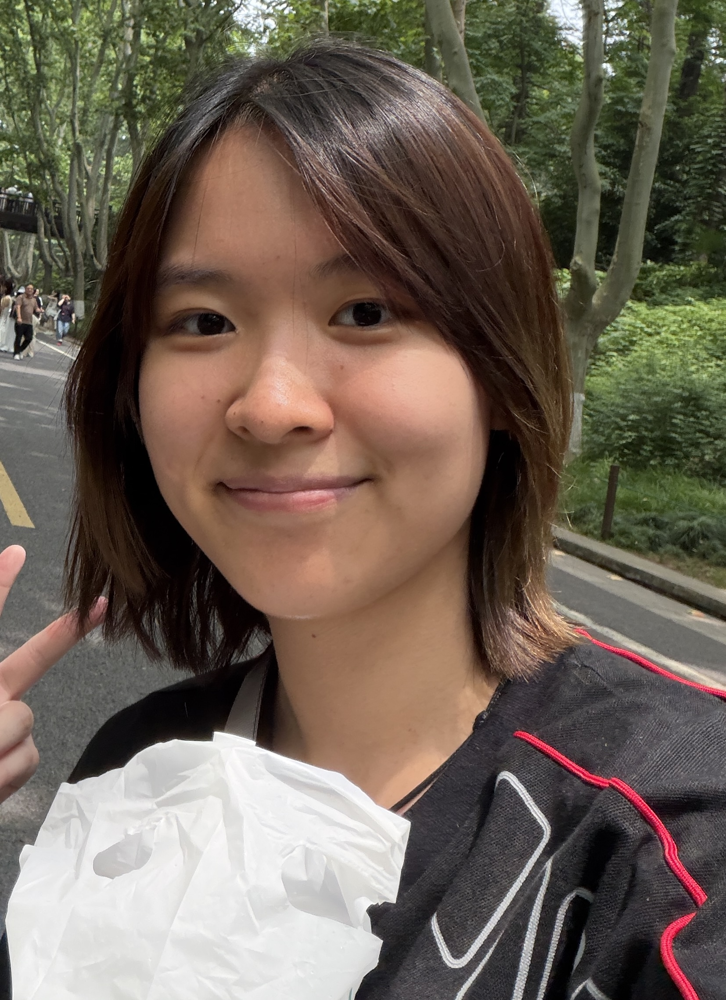

We are a team based in the [School of Computing, National University of Singapore](https://www.comp.nus.edu.sg).

You can reach us at the email `seer[at]comp.nus.edu.sg`

## Project team

### John Doe

[[homepage](http://www.comp.nus.edu.sg/~damithch)]
[[github](https://github.com/johndoe)]
[[portfolio](team/johndoe.md)]

* Role: Project Advisor

### Myat

[[github](https://github.com/My2h)]

* Role: Developer
* Responsibilities: Code quality (looks after code quality and ensures adherence to coding standards)
### Yu Yuxin

[[github](http://github.com/yx-0000)]

* Role: Developer
* Responsibilities: Design the UI/UX.

### Qu Jingran

[[github](https://github.com/Qu-Jingran)]

* Role: Developer
* Responsibilities: UI

### Tan Khian Yiong Thomas

[[github](http://github.com/tkythomas)]

* Role: Developer
* Responsibilities: Dev Ops + Threading

### James Doe

[[github](http://github.com/johndoe)]
[[portfolio](team/johndoe.md)]

* Role: Developer
* Responsibilities: UI
