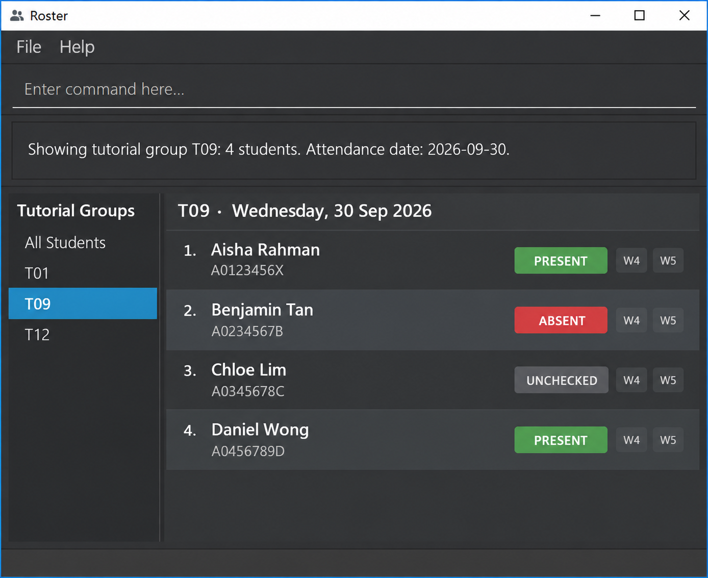

AddressBook Level 3 (AB3) is a **desktop application for managing contacts, optimized for use through a Command Line Interface (CLI)** while retaining the benefits of a Graphical User Interface (GUI). If you type quickly, AB3 can help you manage contacts faster than traditional GUI applications.

* Table of Contents
{:toc}

--------------------------------------------------------------------------------------------------------------------

## Quick start

1. Ensure that Java `25` or later is installed on your computer. 
   **Mac users:** Ensure you have the precise JDK version prescribed [here](https://se-education.org/guides/tutorials/javaInstallationMac.html).

1. Download the latest `.jar` file from [here](https://github.com/se-edu/addressbook-level3/releases).

1. Copy the file to the folder you want to use as the _home folder_ for your AddressBook.

1. Open a terminal, `cd` to the folder containing the JAR file, and run `java -jar addressbook.jar`. 
   A GUI similar to the one below should appear in a few seconds. Note how the app contains some sample data. 
   

1. Type a command in the command box and press Enter to execute it. For example, type **`help`** and press Enter to open the help window. 
   Some example commands you can try:

   * `list` : Lists all contacts.

   * `add n/John Doe p/98765432 e/johnd@example.com a/John street, block 123, #01-01` : Adds a contact named `John Doe` to the Address Book.

   * `delete 3` : Deletes the 3rd contact shown in the current list.

   * `clear` : Deletes all contacts.

   * `exit` : Exits the app.

1. Refer to the [Features](#features) section below for details of each command.

--------------------------------------------------------------------------------------------------------------------

## Features

**:information_source: Notes about the command format:** 

* Words in `UPPER_CASE` are the parameters to be supplied by the user. 
  For example, in `add n/NAME`, replace `NAME` with a value such as `John Doe`.

* Items in square brackets are optional. 
  For example, `n/NAME [t/TAG]` can be used as `n/John Doe t/friend` or as `n/John Doe`.

* Items followed by `…`​ can appear zero or more times. 
  For example, `[t/TAG]…​` may be omitted, or written as `t/friend` or `t/friend t/family`.

* Parameters can be in any order. 
  For example, if the command specifies `n/NAME p/PHONE_NUMBER`, `p/PHONE_NUMBER n/NAME` is also acceptable.

* Extraneous parameters for `help`, `exit`, and `clear` are ignored. 
  For example, `help 123` is interpreted as `help`.

* If you are using a PDF version of this document, be careful when copying and pasting commands that span multiple lines as space characters surrounding line-breaks may be omitted when copied over to the application.

### Viewing help: `help`

Shows a message explaining how to access the help page.

Format: `help`

### Adding a person: `add`

Adds a person to the address book.

Format: `add n/NAME p/PHONE_NUMBER e/EMAIL a/ADDRESS [t/TAG]…​`

:bulb: **Tip:**
A person can have any number of tags, including zero.

Examples:
* `add n/John Doe p/98765432 e/johnd@example.com a/John street, block 123, #01-01`
* `add n/Betsy Crowe t/friend e/betsycrowe@example.com a/Newgate Prison p/1234567 t/criminal`

### Listing students: `list`

Shows all students or the students of one registered tutorial group, sorted by matriculation number.

Format: `list [grp/GROUP]`

Examples:
* `list` shows every student and clears the active group and any previous search filter.
* `list grp/T09` shows only T09's students and makes T09 the active group.
* `list grp/t09` works too: group codes ignore letter case and surrounding spaces.

Group codes have one or two letters followed by two digits, such as `T09` or `TG01`.
The group must already exist. Listing an empty group is allowed; listing a nonexistent group is an error.

| Situation | Feedback |
| --- | --- |
| All students | `Listed all 58 students.` (with the actual count) |
| One group | `Listed 20 students in T09.` (with the actual count and group) |
| Registered but empty group | `Tutorial group T09 has no students yet.` |
| Empty roster | `No students in Roster. Create a tutorial group and add students to get started.` |
| Unknown group | `Tutorial group T09 does not exist. Create it first with: init grp/T09` |

Each student's card shows their details and attendance for every session of their group, in teaching-week order:
`P` means present, `A` means absent, and `—` means unmarked. A student added after a session also shows `—`
until their attendance is recorded. Weeks with no session have no cell. The list scrolls when needed.

The group scope is shown above the list. `find` searches across groups and clears the active group.
Adding or deleting a student refreshes the current results without clearing the filter.
Student indices are the row numbers currently on screen, so check the displayed list before using `delete` or `mark`.

Only one `grp/` parameter is allowed. Missing group values, invalid codes, repeated parameters and unrelated arguments
are rejected. A rejected list command leaves the data, active group and displayed rows unchanged.

### Editing a person: `edit`

Edits an existing person in the address book.

Format: `edit INDEX [n/NAME] [p/PHONE] [e/EMAIL] [a/ADDRESS] [t/TAG]…​`

* Edits the person at the specified `INDEX`. The index refers to the index number shown in the displayed person list. The index **must be a positive integer** 1, 2, 3, …​
* At least one of the optional fields must be provided.
* Existing values will be updated to the input values.
* When editing tags, all of the person's existing tags are removed; adding tags is not cumulative.
* To remove all of a person's tags, enter `t/` without a tag after it.

Examples:
*  `edit 1 p/91234567 e/johndoe@example.com` Edits the phone number and email address of the 1st person to be `91234567` and `johndoe@example.com` respectively.
*  `edit 2 n/Betsy Crower t/` Edits the name of the 2nd person to be `Betsy Crower` and clears all existing tags.

### Locating students by name: `find`

Finds students whose names contain the search phrase.

Format: `find n/KEYWORD`

* The `n/` prefix is required and must appear exactly once. The keyword can contain several words, such as `john tan`.
* Surrounding whitespace is ignored, and repeated whitespace is treated as one space in both the query and name.
* The query must contain 1–100 characters after whitespace normalization: letters, spaces, hyphens, apostrophes or full stops, with at least one letter.
* The search is case-insensitive and considers only names. Accents and punctuation remain significant.
* The entire phrase must appear contiguously and in the same order. For example, `john tan` matches `John Tan` and `John Tanner`, but does not match `John Lim`, `Mei Tan` or `Tan John`.
* Whole-word phrase matches appear first, followed by partial matches. For example, `find n/john` lists `John Tan` before `Johnny Lim` even if `Johnny Lim` was added first. Within each tier, students retain their roster order.
* Each search considers all students, including when the previous search returned no matches.
* Successful searches show `Found COUNT student(s) matching "KEYWORD".` A search with no matches produces an empty list and shows `No students found matching "KEYWORD". Try another name.`
* Missing or blank queries, repeated `n/` prefixes, unsupported characters, text before `n/`, and other parameters produce an error without changing the displayed list.
* `delete INDEX` and `edit INDEX` use the displayed result indexes. Search does not change the saved roster order. Use `list` to show everyone again in ascending matriculation-number order.

Examples:
* `find n/John` returns `John Doe` before `Johnny Lim`.
* `find n/john tan` returns `John Tan` before `John Tanner`.
* `find n/joh` returns names containing `joh`, including `John Tan` and `Johnny Lim`.

### Deleting a person: `delete`

Deletes the specified person from the address book.

Format: `delete INDEX`

* Deletes the person at the specified `INDEX`.
* The index refers to the index number shown in the displayed person list.
* The index **must be a positive integer** 1, 2, 3, …​

Examples:
* `list` followed by `delete 2` deletes the 2nd person in the address book.
* `find n/Betsy` followed by `delete 1` deletes the 1st person in the results of the `find` command.

### Clearing all entries: `clear`

Clears all entries from the address book.

Format: `clear`

### Exiting the program: `exit`

Exits the program.

Format: `exit`

### Saving the data

AddressBook automatically saves data after every command. You do not need to save manually.

### Editing the data file

AddressBook data is saved automatically as a JSON file `[JAR file location]/data/addressbook.json`. Advanced users are welcome to update data directly by editing that data file.

:exclamation: **Caution:**
If your changes make the data file invalid, AddressBook starts with an empty address book at the next run. The invalid file remains on disk until you run a command (AddressBook saves after every command). Still, we recommend backing up the file before editing it. 
Furthermore, certain edits can cause the AddressBook to behave in unexpected ways (e.g., if a value entered is outside of the acceptable range). Therefore, edit the data file only if you are confident that you can update it correctly.

### Archiving data files `[coming in v2.0]`

_Details coming soon ..._

--------------------------------------------------------------------------------------------------------------------

## FAQ

**Q**: How do I transfer my data to another computer? 
**A**: Install the app on the other computer and overwrite the data file it creates with the data file from your previous AddressBook home folder.

--------------------------------------------------------------------------------------------------------------------

## Known issues

1. **When using multiple screens**, if you move the application to a secondary screen, and later switch to using only the primary screen, the GUI will open off-screen. The remedy is to delete the `preferences.json` file created by the application before running the application again.
2. **If you minimize the Help Window** and then run the `help` command (or use the `Help` menu, or the keyboard shortcut `F1`) again, the original Help Window will remain minimized, and no new Help Window will appear. The remedy is to manually restore the minimized Help Window.

--------------------------------------------------------------------------------------------------------------------

## Command summary

Action | Format, Examples
--------|------------------
**Add** | `add n/NAME p/PHONE_NUMBER e/EMAIL a/ADDRESS [t/TAG]…​`   e.g., `add n/James Ho p/22224444 e/jamesho@example.com a/123, Clementi Rd, 1234665 t/friend t/colleague`
**Clear** | `clear`
**Delete** | `delete INDEX`  e.g., `delete 3`
**Edit** | `edit INDEX [n/NAME] [p/PHONE_NUMBER] [e/EMAIL] [a/ADDRESS] [t/TAG]…​`  e.g., `edit 2 n/James Lee e/jameslee@example.com`
**Find** | `find n/KEYWORD`  e.g., `find n/John Tan`
**List** | `list`
**Help** | `help`
